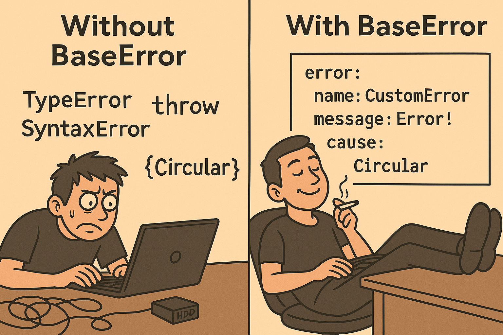

# 💥 JS Base Error

Унифицированная и безопасная система ошибок для `TypeScript`.

    npm i js-base-error

* Базовый класс `BaseError`(наследует стандартную `Error` и `ErrorLike`).
* ⚡Молниеносная ошибка без захвата стека `LiteError`(наследует `ErrorLike`).
* Декларативное определение полей(`name` и т.п.) для вывода в JSON или строку.
* Безопасное преобразование к JSON (`errorToJsonLike`).
* Форматирование к человекочитаемому многострочному тексту (`errorToString`).
* Простое расширение через наследование (`class MyError extends BaseError`).

- [🔥 Использование](#-использование)
- [🛠️ Внутренний механизм и зарезервированное поле `detail`](#️-внутренний-механизм-и-зарезервированное-поле-detail)
- [📌 Резервное поле `__meta` для JSON](#-резервное-поле-__meta-для-json)
- [⚙️ Требования к окружению и компиляции](#️-требования-к-окружению-и-компиляции)
- [👇 Использование в зависимых библиотеках](#-использование-в-зависимых-библиотеках)

**Совет:** Используй `LiteError` вместо `Error`. Нативная ошибка полезна только для отладки и трассировки - во всех остальных случаях `LiteError` быстрее, безопаснее и предсказуемее. [bench.js](scripts/likeVsNative.bench.js):

```
LiteError (ErrorLike) - chromium
  249.97x faster than Error (native)
  281.48x faster than BaseError (native + ErrorLike)
```

## 🔥 Использование

```ts
import {
  type TNullish,
  type TJsonLike,
  type TErrorLevel,
  type IErrorDetail,
  type IErrorLike,
  type IErrorCollection,
  type TMetaValue,
  type TMetaTruncated,
  type TMetaPlaceholder,
  type TSerializationOptions,
  SerializationParameters,
  ensureSerializationParameters,
  captureStackTrace,
  defineErrorLike,
  ErrorLike,
  LiteError,
  BaseError,
  ErrorCollection,
  isErrorLike,
  errorToJsonLike,
  errorToString
} from 'js-base-error'
```

### 🚀 Быстрый старт

Определи базовые ошибки приложения:

```ts
class AppError extends BaseError {
  // Все перечислимые свойства класса на любой иерархии - будут скопированы.
  override name = 'AppError'
  code = 'E0058'
  constructor(detail: IErrorDetail) {
    super(detail)
  }
}

const error = new AppError({ message: 'Oh no 😮', cause: { reason: '🕷️' } })
```

Приведи ошибку к форматированной строке:

```ts
const str = error.toString()
```
```
name: AppError
message: Oh no 😮
code: E0058
cause:
  reason: 🕷️
```

Используй функции [`errorToJsonLike(...)` и `errorToString(...)`](./src/serialization.ts) или передай параметры ограничений в расширенные методы `toJsonWith(...)` и `toStringWith(...)`:

```ts
const json = error.toJsonWith({ includeStack: true })
{
  name: 'AppError',
  message: 'Oh no 😮',
  code: 'E0058',
  cause: { reason: '🕷️' },
  stack: 'Error: ...'
}
```

`LiteError` обеспечивает тот же API, но не захватывает `stack`(высокая скорость и низкая стоимость создания):

```ts
(error instanceof ErrorLike) // true
(new LiteError() instanceof ErrorLike) // true
```

### ⚙️ Конфигурация ограничений вывода полей JSON

Конфигурация ограничений позволяет контролировать глубину и объем сериализуемых данных при логировании или экспорте ошибок. Это особенно важно при работе с большими объектами, вложенными коллекциями и рекурсивными структурами(рекурсия игнорируется). Настройка ограничений предотвращает раздувание логов и защищает систему от случайного вывода чувствительных данных.

Опции `TSerializationOptions` позволяют задать лимиты длины строк, количества элементов и исключить поля по имени. Это гарантирует компактный и безопасный формат даже при сложных ошибках.

Параметры ограничений [`SerializationParameters` и `TSerializationOptions`](./src/options.ts) можно передать для каждого запроса или установить глобальную конфигурацию:

```ts
SerializationParameters.configure({
  maxItems: 2,
  maxTotalItems: 10,
  maxStringLength: 8,
  exclude: ['token'], // запрещаем вывод
  // ... и еще несколько опций
})
```

Теперь вызов методов `toJson()/toJSON()/toJsonWith()/toString()/toStringWith()` и функций `errorToJsonLike()/errorToString()` используют эти параметры по умолчанию без повторной инициализации.

### 🎲 Агрегирование ошибок

`ErrorCollection` объединяет ошибки и выводит коллекцию как одно поле(внутри другой ошибки) или как самостоятельный массив:

```ts
const combined = new ErrorCollection([
  new LiteError({ message: '123456789', level: 'debug' })
])

combined.push({ name: 'TokenError', token: 'private' })

const list = combined.toStringWith(/* global */)
```

Результат с ограничением полей:

```
[0]:
  name: LiteError
  message: 12345678
  __meta:
    kind: object
    total: 3
    truncated: 1
[1]:
  name: TokenError
```

<details>
  <summary>💣 Не открывай, здесь может быть ошибка ... 💥</summary>

_Эта ошибка состоит из нескольких ошибок, коллекции и еще много чего_

```ts
throw new CosmicRayFluxError()
```

Посмотреть на нее можно здесь [errors.test.ts](./src/errors.test.ts)

```
name: CosmicRayFluxError
message: A high-energy particle corrupted a critical memory address.
code: CRF-001
stack: CosmicRayFluxError: A high-energy particle...
      at processTransaction (/app/services/payment.js:123:45)
      at handleRequest (/app/server.js:80:10)
cause:
  name: DatabaseTimeoutError
  message: Query timed out while fetching user data
  query: SELECT * FROM users;
  timeout: 3000
level: fatal
timestamp:
  __meta:
    type: date
    value: 2025-12-25T13:37:00.000Z
transactionId:
  __meta:
    type: bigint
    value: 123456789012345678901234567890
validator:
  __meta:
    type: regexp
    value: /^[a-zA-Z0-9]+\\n$/
affectedSystem:
  service: auth-service
  cpuCore: 7
  isCritical: true
failedAttempts:
  [0]: 1
  [1]: two
  [2]:
    __meta:
      type: symbol
      value: Symbol(three)
subsystemFailures:
  [0]:
    __meta:
      kind: error
      name: CacheMissError
      message: Session data not found in Redis
  [1]:
    __meta:
      kind: error
      name: MetricsError
      message: Failed to report to Prometheus
```
</details>

## 🛠️ Внутренний механизм и зарезервированное поле `detail`

Основой `js-base-error` является концепция **ленивой инициализации** и **декларативного определения** полей ошибки. Это позволяет легко создавать иерархии ошибок, где свойства определяются прямо в классах, а вся сложная работа по их сбору происходит автоматически и только при необходимости.

Ключевую роль в этом играет свойство `detail`.

### Как работает `detail`: от Геттера к Свойству

> ⚠️ Важно: Приватное поле `_detail` зарезервировано для хранения ссылки на объект переданный конструктору.

При создании экземпляра ошибки (`new AppError(...)`), свойство `detail` на самом деле является **геттером**, унаследованным от прототипа `ErrorLike`.

1. **Ленивая инициализация:** Вся _"магия"_ происходит только в момент **первого обращения** к `error.detail`. До этого момента не производится никаких дорогостоящих операций по сбору свойств. Это полезно в сценариях, где ошибка создается, но ее детали могут никогда не понадобиться.
2. **Сбор свойств:** При первом вызове геттер `detail` запускает внутренний механизм (`captureErrorProperties`), который сканирует экземпляр ошибки и всю его цепочку прототипов. Он собирает все **собственные перечислимые свойства** (`enumerable: true`), которые находит на своем пути.
3. **Правило приоритетов:** При сборке свойств действует простое правило: значения из объекта `_detail`, переданного в конструктор, имеют наивысший приоритет. Если передать `new AppError({ name: 'Overridden' })`, это значение будет использовано, даже если в классе `AppError` определено `override name = 'AppError'`. Это позволяет гибко переопределять стандартные поля для каждого конкретного случая.
4. **Мемоизация (Замещение геттера):** Сразу после того, как все свойства собраны в единый объект(приватный `_detail`), геттер `detail` на экземпляре ошибки **замещается** простым свойством, значением которого становится этот собранный объект. Все последующие обращения к `error.detail` будут мгновенно возвращать этот объект, минуя всю логику инициализации. Это можно проверить с помощью `Object.hasOwn(error, 'detail')`, который вернет `false` до первого доступа и `true` после.

**Зарезервированные поля:**

* `get detail()` - Свойство прототипа с ленивым инициализатором. Всегда возвращает объект, даже если не были переданы параметры.
* `_detail` - Приватное(protected) поле данных. Принадлежит инстансу для хранения объекта с деталями ошибки, который передается конструктору. Кто определяет это поле не имеет значения, но именно его будет читать инициализатор. Если это объект `{}` - ссылка используется как есть(возвращается через `detail`), иначе игнорируется.
* `toString()/toJson()/toJSON()/toStringWith()/toJsonWith()` - Методы форматирования.

Доступ ко всем функциям библиотеки:

```ts
import { inspectAny, ... } from 'js-base-error/dev' // <- dev

const [type, value] = inspectAny(anyValue, ...)
```

### Иерархия ошибок приложения

Чаще всего ошибки не имеют сложных методов, но для примера определим поле, синхронизирующее доступ к `detail` через перечислимое свойство-аксессор:

```ts
// Расширим стандартные поля для TS и автоподсказок в IDE
interface ILibErrorDetail extends IErrorDetail {
  features?: string
}

// Базовая ошибка библиотеки
class LibError extends BaseError<ILibErrorDetail> {
  override readonly name: string = 'LibError'
  readonly lib = 'lib_v5.04.85.test'

  // Такое необходимо для defineProperty
  declare features: string
}

// Синхронизация features с detail
Object.defineProperty(LibError.prototype, 'features', {
  enumerable: true,
  // Обращаться нужно именно к detail. Беспокоится о круговых
  // ссылках не стоит - об этом позаботится инициализатор.
  get () { return this.detail.features ?? 'default' },
  set (v) { this.detail.features = v }
})

// Конкретизированные ошибки
class ConcreteError extends LibError {
  // Переопределяет базовое имя
  override readonly name = 'ConcreteError'
}
```

Значения параметров `IErrorDetail` имеют приоритет и перезапишут любое поле по умолчанию:

```ts
const error1 = new ConcreteError({ features: 'custom' })
const error2 = new ConcreteError({ name: 'RenamedError' })

// Поле `detail` инициализируется после первого вызова
Object.hasOwn(error1, 'detail') // false

error1.detail // ===
{
  name: 'ConcreteError',
  lib: 'lib_v5.04.85.test',
  features: 'custom'
}

error2.detail // ===
{
  name: 'RenamedError',
  lib: 'lib_v5.04.85.test',
  features: 'default'
}

Object.hasOwn(error1, 'detail') // true
```

**Ограничения:**

Поля данных(переопределенные `name` и `lib`), собираемые в `detail`, не могут быть синхронизированы и, в первую очередь, предназначены для декларативного определения константных значений ошибки. Значения таких полей, собираются один раз, и последующие изменения доступны только через `detail`.

### Рекомендации

Нет функциональной разницы между `BaseError`, `LiteError` и любым пользовательским классом, расширяющим `ErrorLike`. Все они обладают единым интерфейсом и одинаковым поведением при сериализации, форматировании и проверке типов (`error instanceof ErrorLike`).

Разница лишь в том, нужен ли приложению стек вызовов:

* Используй `BaseError`, если стек помогает при отладке, тестировании или трассировке.
* Используй `LiteError`, если ошибка создаётся часто (валидация, отмена, таймаут, ...) и стек не имеет смысла.
* Для гибридных сценариев можно определить абстрактную базу, которая выбирает реализацию в зависимости от окружения (dev / prod).

Таким образом, выбор реализации не влияет на API, сериализацию и контракты, а лишь на стоимость создания и наличие стека.

В небольших и средних проектах удобно централизовать определения ошибок в отдельном модуле `errors.ts`. Такой подход позволяет:

* Хранить всю иерархию ошибок в одном месте.
* Быстро переключаться между `BaseError` и `LiteError` в зависимости от окружения.
* Использовать единый интерфейс `ErrorLike` для всех подсистем.

```ts
// Определим две версии базовой ошибки с одним именем:
//  + BaseError - Версия для разработки с трассировкой
//  + LiteError - Версия для минифицированного приложения
const Base = (mode === 'production' ? LiteError : BaseError) as typeof LiteError

class AppError extends Base { }

// Конкретизированные ошибки
class PermissionError extends AppError {
  override readonly name = 'PermissionError'
  constructor(message: string) {
    super({ message })
  }
}

// В режиме 'development', такая ошибка получит поле `stack`
const error = new PermissionError('...')
```

Вариант ошибки без `BaseError` и управляемым стеком здесь [capture.test.ts](./src/capture.test.ts).

## 📌 Резервное поле `__meta` для JSON

**`__meta`** - служебный объект, вставляемый только в трех ситуациях:

1. **Верхний уровень** - когда результат не объект (примитив/массив), но нужно вернуть в виде объекта.
2. **Замещение значения** (value placeholder) - когда поле не может быть полноценно сериализовано (`Date`, `bigint`, `function` и т.п.).
3. **Усечение** - когда массив/объект/уровень был усечен из-за лимитов.

Внутренние свойства `__meta` однозначно интерпретируют характер контейнера:

1. `type: string` - Тип значения (value type). Примеры: `'null' | 'boolean' | 'number' | 'string' | 'date' | 'bigint' | 'symbol' | 'regexp' | 'function'`. При наличии `type` `__meta` трактуется как заместитель значения и ожидается поле `value` - представление значения (например ISO для `date`, строка для `bigint`, строка-репрезентация для `regexp` и т.п.).
2. `kind: 'object' | 'array' | 'error'` - Тип усеченного или замененного контейнера. Никогда не используется совместно с `type`.
3. `total: number, truncated: number` - Усеченный контейнер(объект или массив) - общее количество элементов и сколько не вошло в результат.
4. `length: number` - Информация о замещенном контейнере - количество полей объекта или массива.
5. `name: string, message?: string` - поля для описания ошибок при `kind:'error'`.

Безопасные методы ошибок(`toString(), ...`) и функции `errorToJsonLike()` или `errorToString()`, позволяют привести любые данные к допустимому типу JSON или строке:

```ts
const jsonLike = errorToJsonLike({
  he: 'Hello, Error Like!',
  get good () { return 'good' },
  get bad () { throw new Error('bad') }, // проигнорирует
  re: /^[0-9]+$/i,
  bg: 123n,
  sm: Symbol('hidden'),
  dt: new Date('2025-12-25T13:37:00.000Z'),
})
```

Некорректные типы _"заворачиваются"_ в мета-объекты:

```ts
{
  he: 'Hello, Error Like!',
  good: 'good',
  re: { __meta: { type: 'regexp', value: '/^[0-9]+$/i' } },
  bg: { __meta: { type: 'bigint', value: '123' } },
  sm: { __meta: { type: 'symbol', value: 'Symbol(hidden)' } },
  dt: { __meta: { type: 'date', value: '2025-12-25T13:37:00.000Z' } }
}
```

> Зарезервированное имя поля `__meta` изменяется опцией `metaFieldName` и всегда имеет приоритет над именами полей ошибок.

Примеры:

1. Объект сериализации верхнего уровня оказался примитивом, массивом или типом который не подлежит структурной сериализации:

```json
{ __meta: { type: 'boolean' | 'number' | ..., value: JsonPrimitive } }

{ __meta: { type: 'array': value: [...] } }
```

2. Значение не подлежит структурной сериализации, например `Date` или `bigint`:

```json
{ fieldName: { __meta: { type: 'date', value: '2025-10-17T00:13:21.801Z' } } }

{ fieldName: { __meta: { type: 'bigint', value: '541230557920596605488' } } }
```

3. Усечение полей объектов или массивов при превышении лимита. Мета-информация добавляется в усеченный контейнер, чтобы сообщить о неполноте данных:

```json
{
  fieldName: ...,
  __meta: { kind: 'object', total: 75, truncated: 28 }
}

[
  item0,
  item1,
  { __meta: { kind: 'array', total: 369, truncated: 67 } } 
]
```

1. Заменитель объекта при превышении глубины:

```json
{
  fieldObject: { __meta: { kind: 'object', length: 24 } },
  fieldArray:  { __meta: { kind: 'array', length: 785 } },
  fieldError:  { __meta: { kind: 'error', name: 'Error', message?: '...' } }
}
```

## ⚙️ Требования к окружению и компиляции

`js-base-error` спроектирован с использованием современных возможностей JavaScript и TypeScript. Для корректной и предсказуемой работы, особенно при наследовании и переопределении полей, проект должен быть настроен с учетом следующих моментов.

**Крайне рекомендуется** установить в `tsconfig.json` флаг `"useDefineForClassFields": true` (или использовать `target: "ES2022"` и выше, где этот флаг включен по умолчанию):

```json
{
  "compilerOptions": {
    "useDefineForClassFields": true
  }
}
```

**Почему это важно?**

`LiteError`, `BaseError` и `abstract ErrorLike` определяют стандартные свойства `name` и `message` как **аксессоры** (геттеры/сеттеры) на своем прототипе. Это позволяет синхронизировать значения `name` и `message` из `detail`, что полностью повторяет поведение нативной ошибки.

Когда в классе-наследнике переопределяется:
```ts
class MyError extends BaseError {
  override readonly name = 'MyError'
}
```

...существует два способа, как TypeScript может это скомпилировать:

1. С `"useDefineForClassFields": true` (Правильно): Поле `name` будет создано на **экземпляре** (аналогично `Object.defineProperty`). Это _"сильная"_ операция, которая **перекрывает** аксессор прототипа. Все работает как ожидается - свойство будет успешно собрано в `detail`.
2. С `"useDefineForClassFields": false` (Непредсказуемо): Поле класса будет скомпилировано в простое присваивание в конструкторе (`this.name = 'MyError'`). Эта операция будет **перехвачена сеттером** прототипа. В результате, свойство `name` **не будет создано** на экземпляре, а доступ к `detail` запустит механизм преждевременной инициализации(хотя и безопасной).

Результатом обоих вариантов будет один и тот же `detail`, но преждевременный сбор полей ошибки, которые могут никогда не понадобиться, это не то что мы ожидаем. _Для справки: Внутренний механизм нативной ошибки(NodeJS) - так же не форматирует `stack`, пока нет явного запроса к полю. Chrome меняет только name._

Чтобы гарантировать консистентное и предсказуемое поведение - убедитесь, что используется современный стандарт определения полей классов.

## 👇 Использование в зависимых библиотеках

Когда несколько библиотек зависят от одного общего пакета `js-base-error`, рекомендуется указывать его в разделе `peerDependencies` каждой библиотеки. Это необходимо для обеспечения корректной работы оператора `error instanceof ErrorLike`. Несогласованность версий или множественные экземпляры `js-base-error` могут нарушить сравнение через `instanceof` и логические проверки типов, приводя к неочевидным ошибкам.

**Подход, рекомендуемый при работе с библиотеками, разделяющими общие классы:**

В библиотеке зависимой от `js-base-error` [peerDependencies](https://docs.npmjs.com/cli/v9/configuring-npm/package-json#peerdependencies):

```json
"peerDependencies": {
  "js-base-error": "0.6.0"
}
```

В основном приложении обеспечиваем одну версию `js-base-error` для всех зависимостей через [overrides](https://docs.npmjs.com/cli/v9/configuring-npm/package-json#overrides):

```json
"dependencies": {
  "js-base-error": "0.6.0"
},
"overrides": {
  "js-base-error": "0.6.0"
}
```

Проверить все установленные версии одного пакета можно командой `npm list js-base-error`. Если обнаружено несколько версий, команда покажет дерево зависимостей:

```
my-app@1.0.0
├─┬ my-lib@0.1.0
│ └── js-base-error@0.5.0
└── js-base-error@0.6.0
```

Смотрите так же [npm dedupe](https://docs.npmjs.com/cli/v11/commands/npm-dedupe).



_AI-art by ChatGPT_
